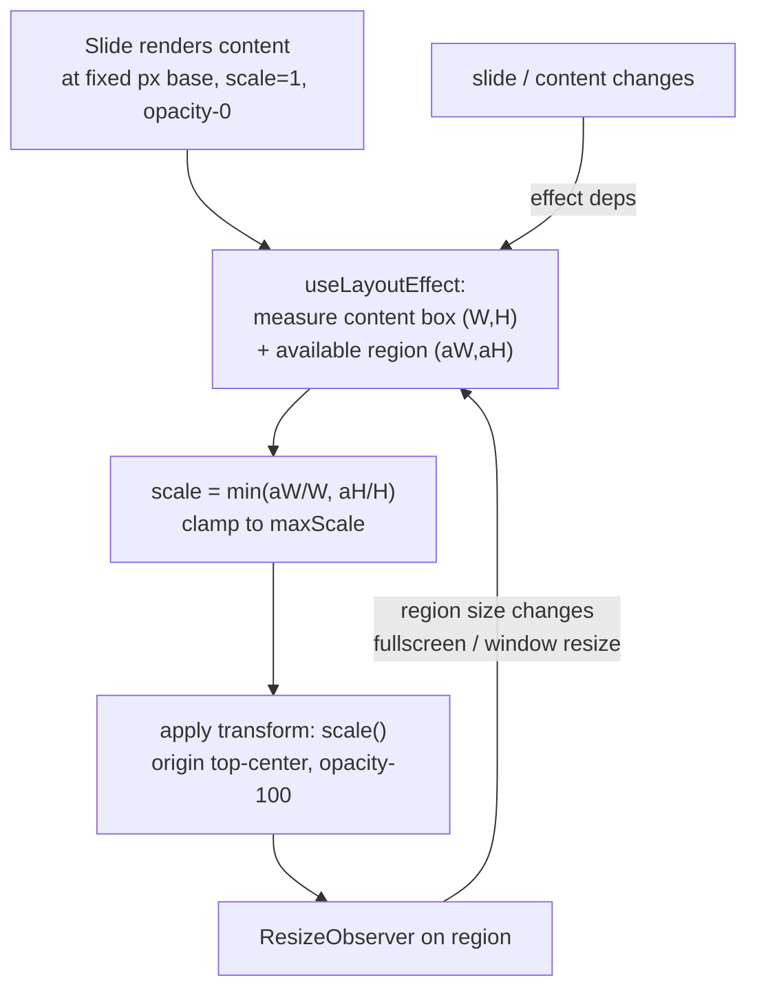

# feat: Auto-fit OOP slide content for large-room readability

**Target repo:** `trivia-platform` (work happens under `web/`)

## Summary

The Out of Pocket (OOP) presenter slides render question content (SQL snippets,
logos, matching lists) small and floating in the vertical center of the card,
leaving large empty margins above and below. This is hard to read in large
rooms. This plan introduces a **content-aware auto-fit** primitive that measures
each slide's content against its available area and scales it up to fill the
space, and refactors the question + reveal slide layouts to **top-anchor their
heading** and let the body grow as large as it can.

The key insight: the slides already scale proportionally with the card via
container-query (`cqw`) units, so they are *device*-responsive — but `cqw` is
blind to **content length**. A 3-line SQL block and a 16-line match list both
get the same hand-tuned `cqw` size, so short content floats tiny in a big card.
Auto-fit fixes the actual problem by sizing to the content-to-space ratio.

---

## Problem Frame

**Who is affected:** Quiz hosts presenting the OOP deck on a projector/large
screen, and the audience reading from the back of a room.

**Current behavior** (see `web/src/components/oop/OopSlides.tsx`):
- `OopQuestionSlide` and `OopRevealSlide` wrap content in
  `... flex flex-col items-center justify-center ...` — content is vertically
  centered, so sparse slides (a single code block or one logo) sit small in the
  middle with big empty bands top and bottom.
- Font sizes are fixed hand-tuned `cqw` values tuned conservatively to avoid
  overflow on the *densest* content: code at `1.8cqw` (reveal `1.5cqw`), match
  definitions at `1.2cqw`/`1.3cqw`, match terms at `1.5cqw`. These are too small
  for sparse slides and for back-of-room legibility.
- The match layouts already top-anchor (`top-[9%]`) but waste the lower half of
  the card because the lists are sized for worst-case density, not the actual
  list.

**Desired behavior:**
- Question/reveal **heading pinned to the top** of the card at a readable size.
- Body content (SQL, image, bullets, answer, match columns) scaled **as large as
  it fits** in the remaining area — short content gets big, dense content settles
  at just-fits — always staying inside the template's safe insets (clear of the
  baked-in corner quote marks and dividers).

**In scope:** `OopQuestionSlide`, `OopRevealSlide`, `OopMatchQuestion`,
`OopMatchReveal`, and a new shared auto-fit component.

**Out of scope (this PR):** Cover, Section-divider, and Answers-divider slides
(`OopCoverSlide`, `OopSectionSlide`, `OopAnswersDividerSlide`) — they are not in
the reported screenshots and their fixed layouts read fine. The generic
(non-OOP) `SlideRenderer.tsx` deck is a separate world and untouched.

---

## Requirements

- **R1** — Question/reveal headings render anchored at the top of the card, not
  vertically centered.
- **R2** — Body content (code block, image(s), bullets, answer, match columns)
  scales up to fill the available area below the heading; sparse
  content gets large, dense content fits without clipping.
- **R3** — Content never overflows the template's safe insets or overlaps the
  baked-in corner quote marks / divider lines at any card size.
- **R4** — Behavior holds across card sizes (windowed, fullscreen, small
  laptop screens) — re-fits on resize and on slide change with no persistent
  layout flicker.
- **R5** — Question and reveal slides for the same question look visually
  consistent (parity).
- **R6** — No regression to existing build/typecheck/lint; the deck data model
  (`deck.ts`) and editor are unchanged.

---

## Key Technical Decisions

### KTD1 — Content-aware auto-fit via measure-and-scale, not bigger `cqw`

`cqw` scales with the card but not with content length, so simply raising the
`cqw` numbers would make dense slides (the 8-pair match list, multi-line SQL)
overflow and clip. Instead, a `FitBox` wrapper measures its content's natural
size against the available area and applies a uniform `transform: scale()` so the
content fills the space. This is the option the user selected and is the only
approach that makes *both* a 3-line SQL block and a 16-line list look right
without per-content hand-tuning.

### KTD2 — Author fitted content at a fixed px base; let the transform own all sizing

Inside a `FitBox`, content is authored in **fixed px/rem** (e.g., heading 40px,
code 32px) rather than `cqw`. If fitted content kept `cqw` units, its measured
"natural" size would itself depend on card size and the scale transform would
double-count, making the fit unstable. Fixed px gives a stable measurement; the
single scale factor does all responsive + content-aware sizing. The template's
percentage **insets** (which define the available *region*, not content size)
stay as-is — they are layout, not type scale.

### KTD3 — `transform-origin: top center`, scale upward allowed

The fit scale is `min(availW / contentW, availH / contentH)` and is allowed to
exceed 1 (upscaling — the whole point). Origin is top-center so the heading pins
to the top (R1) and content grows downward. A `maxScale` clamp (≈3) prevents a
one-word answer from becoming absurdly huge; there is no `minScale` floor below
the just-fits value, since clamping smaller would clip dense content.

### KTD4 — `useLayoutEffect` + `ResizeObserver`, measure before paint

Measure and set scale in `useLayoutEffect` (pre-paint) to avoid a visible jump,
and re-measure via a `ResizeObserver` on the available-area element so fullscreen
toggles and window resizes re-fit. Content changes re-fit through effect deps
(slide identity). Guard state updates with an epsilon comparison to avoid
`ResizeObserver` feedback loops. Content is hidden (`opacity-0`) until the first
measurement resolves, then shown, to prevent first-paint flicker (R4).

### KTD5 — No automated tests; visual verification matches repo convention

The repo has **no test framework** (no Vitest/Jest/Playwright; `package.json`
scripts are `dev`/`build`/`lint`/`export-csv`). Verification is `bunx tsc
--noEmit`, `bun run build`, `bun run lint`, and the **Vercel preview URL** —
which is exactly how the OOP module is reviewed today (per `AGENTS.md`). Adding a
test harness + jsdom + `ResizeObserver` mocks to unit-test scale math is a
separate effort tracked under Deferred Follow-Up Work, not bundled into a
readability PR.

---

## High-Level Technical Design

`FitBox` lifecycle — measure the unscaled content, compute a single uniform
scale to fill the available region, apply it, and re-run when the region
resizes:



Per-slide structure after refactor (question + reveal share this shape):

```
template PNG (absolute background, corner quotes baked in)
└─ content region  (absolute inset box = existing safe insets)
   └─ flex-col, justify-start            ← was justify-center
      ├─ Heading (top-anchored, readable)        R1
      └─ flex-1 area
         └─ <FitBox>  (fills flex-1, overflow-hidden)
            └─ body content authored in fixed px  R2
               (code | image(s) | bullets | answer | match columns)
```

For the match layouts, the heading already sits at top; the change is wrapping
the two-column term/definition block in a `FitBox` so it scales to fill the
currently-wasted lower half.

---

## Implementation Units

### U1. Create the `FitBox` auto-fit primitive

**Goal:** A reusable component that scales its children to fill its own box,
content-aware, re-fitting on resize.

**Requirements:** R2, R3, R4

**Dependencies:** none

**Files:**
- `web/src/components/oop/FitBox.tsx` (new)

**Approach:**
- Props: `children`, optional `maxScale` (default ~3), optional `className` for
  the available-area wrapper, optional `align` (`"top"` default → origin
  top-center; `"center"` for center-center) to support both heading-pinned and
  centered uses.
- Render two nested elements: an **outer** "available area" element (fills its
  parent, `overflow-hidden`, `position: relative`) and an **inner** content
  element (`position: absolute`, top-center anchored, `width: max-content` or
  full width as needed) holding `children`.
- `useLayoutEffect`: read `outer.clientWidth/clientHeight` and the inner's
  natural `scrollWidth/scrollHeight` (at scale 1); compute
  `scale = min(aW/cW, aH/cH)`, clamp to `[_, maxScale]`; store in state; set
  inner `transform: scale(scale)` + `transformOrigin`.
- Attach a `ResizeObserver` to the outer element; recompute on change. Compare
  against current scale with a small epsilon before `setState` to avoid loops.
- Re-run when `children` change (pass a `deps`/`refitKey` prop the slides set to
  the slide number, or rely on children identity).
- Start `opacity-0`; flip to `opacity-100` once first scale is computed.

**Patterns to follow:** The presenter card already uses `[container-type:size]`
and measures available space declaratively (`web/src/app/out-of-pocket/present/page.tsx`);
`FitBox` complements it by measuring *content*. Match existing OOP component
style (function component, Tailwind classes, `"use client"` not needed unless
hooks require — it does, so include it).

**Technical design (directional, not spec):**
```
"use client";
function FitBox({ children, maxScale = 3, align = "top", refitKey }) {
  const outer = useRef, inner = useRef, [scale,setScale] = useState(0)
  useLayoutEffect(() => {
    const fit = () => {
      const { clientWidth:aW, clientHeight:aH } = outer.current
      const cW = inner.current.scrollWidth, cH = inner.current.scrollHeight
      const s = Math.min(aW/cW, aH/cH, maxScale)
      if (Math.abs(s - scaleRef.current) > 0.005) setScale(s)
    }
    fit()
    const ro = new ResizeObserver(fit); ro.observe(outer.current)
    return () => ro.disconnect()
  }, [refitKey, maxScale])
  // outer: relative, h-full w-full, overflow-hidden
  // inner: absolute, left-1/2 -translate-x-1/2 (+ top-0 or top-1/2),
  //        transform: `translateX(-50%) scale(${scale})`, origin per align,
  //        opacity: scale>0 ? 1 : 0
}
```

**Test scenarios:** Test expectation: none (no test framework — see KTD5).
Behavior is verified visually in U4. Manual checks during dev: a single short
child scales up to fill; a tall child scales down to just-fit; resizing the
window re-fits without flicker.

**Verification:** `FitBox` renders children scaled to fill a parent box in a
throwaway harness / on a real slide; `bunx tsc --noEmit` passes.

---

### U2. Refactor standard question + reveal layouts to top-anchor + FitBox

**Goal:** `OopQuestionSlide` and `OopRevealSlide` (non-matching path) pin the
heading to the top and grow the body (code / image / bullets / answer) to fill.

**Requirements:** R1, R2, R3, R5, R6

**Dependencies:** U1

**Files:**
- `web/src/components/oop/OopSlides.tsx`

**Approach:**
- In both components' non-match branch, change the content region wrapper from
  `items-center justify-center` to `flex-col justify-start` with the heading as
  the first child (top-anchored) at a readable size, and a `flex-1` area below.
- Wrap the body group (the `codeBlock` `<pre>`, the `bullets` `<ul>`, the
  `imageSrc/imageSrc2` row, the reveal `answer`, `caption`, `sourceUrl`) inside a
  single `<FitBox>` filling the `flex-1` area, so the whole body scales together.
- Convert fitted body font/size units from `cqw` to fixed px/rem bases (KTD2).
  Pick comfortable ratios (e.g., code ~32px, bullets ~30px, answer ~36px,
  caption ~16px); the transform handles final size. Keep the navy code-block
  styling, border, and cyan text.
- Keep the template PNG background and the existing percentage inset box as the
  safe region. Drop now-redundant `overflow-x-auto` on code (FitBox fits width).
- Reveal holds more content (question + answer + supporting), so its FitBox will
  naturally settle smaller than the question's — that is expected and preserves
  parity (R5) without separate tuning.
- Heading: keep it short/width-bounded; size it generously (it's the user's
  explicit "title at the top" ask). It may live outside FitBox at a fixed
  readable size, or in its own small top-aligned FitBox if very long questions
  need width-fitting — prefer outside-FitBox first, revisit in U4 if long
  questions clip width.

**Patterns to follow:** Existing inset boxes
(`inset-x-[12%] top-[12%] bottom-[14%]`) and the navy `<pre>` code styling in the
current `OopQuestionSlide`/`OopRevealSlide`.

**Test scenarios:** Test expectation: none (no framework — KTD5). Covered by the
U4 visual matrix: SQL/code question (screenshot #1), single-logo question
(screenshot #2), bullets question, and the reveal counterpart of each.

**Verification:** On the Vercel preview, the SQL question shows the title at the
top and a large SQL block; the logo question shows a large logo; no overlap with
corner quotes; reveal slides match their questions. `tsc`, `build`, `lint` pass.

---

### U3. Refactor matching layouts to FitBox

**Goal:** `OopMatchQuestion` and `OopMatchReveal` scale their term/definition
columns up to fill the lower half of the card that is currently wasted.

**Requirements:** R2, R3, R5, R6

**Dependencies:** U1

**Files:**
- `web/src/components/oop/OopSlides.tsx`

**Approach:**
- Keep the heading top-anchored (already is). Wrap the two-column block
  (`OopMatchQuestion`: numbered terms + lettered shuffled defs;
  `OopMatchReveal`: term-beside-correct-definition rows) in a `<FitBox>` filling
  the area below the heading.
- Convert the column font sizes from `cqw` (`1.2`/`1.3`/`1.5cqw`) to fixed px
  bases; the FitBox scale will make an 8-pair list land noticeably larger than
  today while guaranteeing the densest list still fits (R3).
- Preserve the existing left padding that clears the top-left quote and the
  column width ratios (`w-[28%]` terms / flex defs). Keep `shuffledDefs` and the
  navy term/letter accents unchanged.
- Match-reveal currently centers rows (`justify-center`); with FitBox filling the
  region, keep vertical centering *inside* the inner content so a short list
  still looks balanced, or top-align for consistency — decide visually in U4.

**Patterns to follow:** Current `OopMatchQuestion`/`OopMatchReveal` structure and
`MatchHeading`.

**Test scenarios:** Test expectation: none (no framework — KTD5). Covered by U4:
the 8-pair "Match each X-term" slide (screenshot #3) at full size and the reveal
two-column variant; verify the longest definition does not clip and text is
markedly larger than current.

**Verification:** On preview, the X-term matching slide fills the card with
clearly larger text, nothing clipped, quotes clear; reveal matches.

---

### U4. Visual QA + base-size/clamp tuning across the slide matrix

**Goal:** Confirm readability and no-overflow across content types and screen
sizes, and tune the px bases / `maxScale` to taste.

**Requirements:** R1, R2, R3, R4, R5

**Dependencies:** U2, U3

**Files:**
- `web/src/components/oop/OopSlides.tsx` (tuning)
- `web/src/components/oop/FitBox.tsx` (clamp tuning if needed)

**Approach:** Run `bun dev`, open `/out-of-pocket/present`, and step through the
deck. Verify the matrix below; adjust base px values and `maxScale` until sparse
slides are large and dense slides just-fit. Check fullscreen (F key) and a small
laptop window for re-fit and flicker. Run `bunx tsc --noEmit`, `bun run build`,
`bun run lint` before opening the PR (per `AGENTS.md`, build is required
pre-push).

**Verification matrix (manual):**
- Code/SQL question + its reveal (screenshot #1) — title top, big SQL, no clip.
- Single-logo question + reveal (screenshot #2) — large logo, centered.
- Two-image question (if any in deck) — both images scale together, no overlap.
- Bullets/choices question + reveal — bullets large; reveal "real!" marker
  intact.
- 8-pair matching question + reveal (screenshot #3) — fills card, no clip.
- Long-text question (longest in `deck.ts`) — does not overflow width/height.
- Fullscreen toggle and window resize — content re-fits, no persistent flicker.

**Test scenarios:** Test expectation: none (manual visual QA — KTD5).

**Verification:** All matrix rows pass on the Vercel preview; build/typecheck/
lint green.

---

## Risks & Mitigations

- **First-paint flicker / layout shift.** Measure in `useLayoutEffect` and hide
  content (`opacity-0`) until the first scale resolves (KTD4).
- **`ResizeObserver` feedback loop.** Scaling changes content box size, which
  could retrigger the observer. Observe the **outer available area** (whose size
  does not depend on the inner scale), and guard `setState` with an epsilon
  (KTD1/KTD4).
- **Transform blur at non-integer scale.** Acceptable at presentation distance;
  Baloo Da 2 scales cleanly. If objectionable, U4 can switch a specific layout
  to font-size stepping — not expected to be needed.
- **Upscaling tiny content too far.** `maxScale` clamp (KTD3) caps it.
- **Content overlapping baked-in corner quotes.** FitBox lives inside the
  existing percentage safe insets and clips with `overflow-hidden`; insets are
  preserved, so scaled content stays in the safe region (R3).
- **Five-place field sync rule** (per OOP `AGENTS.md`): this plan adds **no new
  question field**, so the five-place sync (deck.ts → types → OopSlides →
  present → editor) does **not** apply — only the render layer changes.

---

## Deferred to Follow-Up Work

- Auto-fit the Cover / Section-divider / Answers-divider slides for consistency
  (out of scope; their fixed layouts read fine today).
- Introduce a test framework (Vitest + jsdom + `ResizeObserver` mock) and unit
  test `FitBox` scale math — currently no test infra exists repo-wide (KTD5).
- Optional accessibility pass beyond size: `prefers-reduced-motion`, focus order,
  and `alt` text for logo images (several `` are decorative today).

---

## Verification Strategy

No automated tests (KTD5). Before opening the PR:
1. `cd web && bunx tsc --noEmit` — typecheck clean.
2. `bun run lint` — eslint clean.
3. `bun run build` — production build succeeds (required pre-push per AGENTS.md).
4. Push branch `oop/slide-auto-fit-readability`; review the **Vercel preview**
   against the U4 verification matrix on a large screen + fullscreen.

---

## Sources & Research

- `web/src/components/oop/OopSlides.tsx` — current slide layouts (centered,
  fixed `cqw`).
- `web/src/app/out-of-pocket/present/page.tsx` — presenter card sizing
  (`[container-type:size]`, 16:9 fit).
- `web/src/app/out-of-pocket/deck.ts` — content model + density (8-pair match,
  multi-line SQL).
- `web/src/app/out-of-pocket/AGENTS.md`, root `AGENTS.md` — OOP module
  conventions, Bun/Next stack, build-before-push, no test framework, Vercel
  preview review flow.
